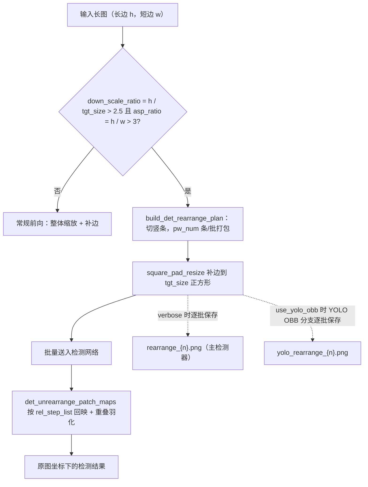
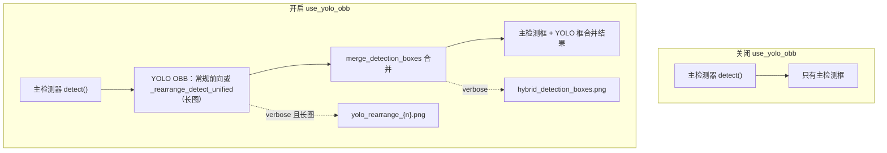

# 输入、检测与长图重排调试产物

当某张图“检测不到文字”“框位置不对”或“长图被切得奇怪”时，通常需要打开“设置 → 通用 → 详细日志”重新运行，然后在 `result/` 的单图调试目录里核对输入图、检测框调试图和长图重排批次。这里说明这些产物的生成条件、画面含义和排查用途，重点区分输入/检测产物与 `rearrange_{n}.png`、`yolo_rearrange_{n}.png` 两个长图重排分支。

调试目录整体命名与结构见[调试目录与总览](./folder-naming-and-overview.md)，OCR 与文本区域产物见[OCR 与文本区域](./ocr-and-text-regions.md)，蒙版、修复与排版产物见[蒙版、修复与排版](./mask-inpainting-and-rendering.md)。这里不展示真实 `.env`、用户图片、私有绝对路径或真实 API 密钥；调试图与路径分享前必须脱敏。

## 先看哪些产物 {#feature-boundary}

- 本页所有产物都以“详细日志”开关为总开关：不开启时不会生成图片级调试子目录，检测阶段也不写调试图。
- `input.png`、`mask_raw.png`、`bboxes_with_scores.png`、`mask_binary.png`、`hybrid_detection_boxes.png`、`bboxes_unfiltered.png`、`bboxes_unfiltered_labeled.png`、`bboxes.png` 属于“输入/检测阶段”调试产物。
- `rearrange_{n}.png` 与 `yolo_rearrange_{n}.png` 只在图片满足长图重排条件时产生，是条件产物；普通图片每次运行都不一定有。
- 两个重排产物分属不同分支：主检测器（默认/DBConvNext/CTD）产生 `rearrange_{n}.png`；YOLO OBB 辅助检测在“启用YOLO辅助检测”开启时产生 `yolo_rearrange_{n}.png`。
- 这些文件是终端诊断写入：静态搜索未发现仓库内对这些文件名的后续读回；消费者是排查问题的操作者或问题报告接收者。

## 查看调试产物 {#ui-operations}

### 开启详细日志并收集输入/检测产物 {#enable-verbose-and-collect}

1. 打开“设置”，进入“通用”分组。
2. 启用“详细日志”开关。
3. 开始翻译。开启后，每张输入图在 `result/` 下建立 `{时间戳}-{图片MD5}-{检测尺寸}-{目标语言}-{翻译器}` 子目录，检测阶段写入 `input.png` 与检测框调试图。
4. 排查时按“输入图 → 检测框 → 重排批次”的顺序打开对应文件，对照本页表格判断问题阶段。

### 调整检测与长图重排参数 {#tune-detection-parameters}

打开“设置”→“检测”分组。“检测大小”同时是常规检测缩放尺寸与长图重排的目标尺寸；“长图重排最低有效短边”控制打包时保留的有效短边分辨率；“启用YOLO辅助检测”决定是否产生 `yolo_rearrange_{n}.png` 与 `hybrid_detection_boxes.png`。

## 输入图与检测框调试产物 {#input-and-detection-artifacts}

下表按检测阶段先后列出本页负责的调试产物。

| 产物 | 写入点 | 触发条件 | 画面/内容 | 排查用途 |
| --- | --- | --- | --- | --- |
| `input.png` | `manga_translator/manga_translator.py` `_translate_until_translation()` | `verbose=True` | 处理前的输入图（保存时 RGB 转 BGR） | 确认喂给管线的原图；检测/OCR 异常时先核对它 |
| `mask_raw.png` | `manga_translator/manga_translator.py`（检测返回 `ctx.mask_raw` 后） | `verbose=True` 且检测返回原始蒙版 | 带置信度颜色映射与 “Confidence” 颜色条的热力图（`_create_confidence_heatmap`） | 检测阈值/漏检排查 |
| `bboxes_with_scores.png` | `manga_translator/manga_translator.py`（检测器第三返回值为调试元组或图像时） | `verbose=True`，检测器返回评分框调试图 | 检测器返回的评分框叠加图 | 检测器内部调试输出 |
| `mask_binary.png` | 同上（二元/三元调试元组） | 同上 | 与评分框图配套的二值掩码 | 检测输出排查 |
| `hybrid_detection_boxes.png` | 同上（第三返回值为图像且 `use_yolo_obb=True`） | `verbose=True`、`use_yolo_obb=True` | 主检测与 YOLO OBB 合并后的框图（来自检测调度的 `draw_detection_debug_image`） | 混合检测合并排查 |
| `bboxes_unfiltered.png` | `manga_translator/manga_translator.py`（检测后、OCR 前） | `verbose=True` 且检测后仍有文本行 | 原图上未过滤文本行框（跳过 `other` 标签） | 检测/OCR 过滤排查 |
| `bboxes_unfiltered_labeled.png` | `manga_translator/manga_translator.py` → `_save_labeled_textline_debug_image()` | 上一条件成立、`ocr.merge_special_require_full_wrap=True`、存在非空文本行 | 带 `序号:标签` 字幕的彩色文本行框（按标签着色） | 模型辅助合并/标签分流排查 |
| `bboxes.png` | `manga_translator/manga_translator.py`（文本行合并后） | `verbose=True` 且存在 `ctx.text_regions` | 最终文本块可视化（是否显示 panel 取决于 `force_simple_sort`） | 合并/排序排查 |

## 长图重排触发与切块机制 {#rearrange-trigger-and-splitting}

重排计划先按长边方向归一化：若 `h < w` 则转置，使 `h` 为长边。它计算 `down_scale_ratio = h / tgt_size`（`tgt_size` 即 `detector.detection_size`，默认 `2048`）与 `asp_ratio = h / w`；只有 `down_scale_ratio > 2.5` 且 `asp_ratio > 3` 时才要求重排，否则走常规前向。

重排时把长条切成若干条带，并按 `pw_num` 打包：`pw_num` 由“不缩放的条带数 `floor(tgt_size / w)`”、“按 `det_rearrange_min_effective_short_side` 计算的分辨率上限”与“legacy 上限 `floor(2 * tgt_size / w)`”共同决定，每个组成批次包含 `pw_num` 个竖条并排。每个批次补边缩放到 `tgt_size × tgt_size` 正方形后送入网络。检测输出回映到原图坐标，条带重叠区按“离条带切割边缘的距离”羽化加权合并，避免被切断文字在接缝处丢框。

相邻条带的起点还强制满足“最小重叠 200px”（`DET_REARRANGE_MIN_OVERLAP`）：片数按 `max_step = ph - 200` 反推，起点首尾贴边、均匀分布，若仍有相邻步长超过上限就自动增片（最多 8 轮保护），`ph_step` 取相邻步长中位数。代价是条带数与检测耗时随图片变长而增加。

检测候选数量默认上限 1000，但只在打分之后按分数保留最高者，不再按 `findContours` 顺序截断；长图回拼后的轮廓数远超单页，此时上限被取消（`max_candidates=None`）。因此既不会因为轮廓顺序偶然丢框，也不会因为 1000 上限丢掉长图末尾的文本框；同时不再返回占位零框。

重排避免把超长图整体缩到检测尺寸导致文字过小；打包批次同时控制单次送入网络的显存占用。`det_rearrange_min_effective_short_side` 越高，每个批次打包的竖条越少、保留的有效短边分辨率越高，文字更清晰但检测更慢（与设置面板说明一致）。

## 重排产物分支 {#rearrange-artifact-branches}

### `rearrange_{n}.png`：主检测器的方形补边批次 {#rearrange-artifact-main}

写入点是 `manga_translator/utils/generic.py` 的 `det_rearrange_forward()` → `_patch2batches()`。触发条件：默认、DBConvNext 或 CTD 检测器调用 `det_rearrange_forward()`，图片满足 `build_det_rearrange_plan()` 的重排条件，且 `verbose=True`。内容：送入检测网络前的方形补边批次——每个 `{n}` 对应一个组成批次（`pw_num` 个竖条并排并补边到 `tgt_size` 后的图像），供长图重排排查：核对切块/打包是否正确、竖条是否完整、补边方向是否符合预期。verbose 时控制台会打印 “Input image will be rearranged to square batches...” 提示。

### `yolo_rearrange_{n}.png`：YOLO OBB 的单个重排 patch {#rearrange-artifact-yolo}

写入点是 `manga_translator/detection/yolo_obb.py` 的 `_rearrange_detect_unified()`。触发条件：`use_yolo_obb=True`、YOLO OBB 也得到长图重排计划、当前 patch 有效（非全零 padding、非空）、`verbose=True`。内容：YOLO OBB 的单个重排 patch——与主检测器使用同一 `build_det_rearrange_plan()` 切块逻辑，因此切割应与 `rearrange_{n}.png` 一致，供混合检测长图排查。全零 padding patch 会被跳过，因此编号 `{n}` 可能不连续。

## 路径与回退 {#paths-and-fallbacks}

- 普通检测调度在 `_run_detection()` 把 `self._result_path` 作为 `result_path_fn` 传给检测器，所以两个重排产物默认落在图片级调试目录：`result/<时间戳>-<MD5>-<检测尺寸>-<目标语言>-<翻译器>/rearrange_{n}.png` 与同目录 `yolo_rearrange_{n}.png`。
- 未提供回调时，`det_rearrange_forward()` 的兜底路径是仓库根 `result/rearrange_{n}.png`（`generic.py`），YOLO OBB 的兜底路径是 `result/yolo_rearrange_{n}.png`（`yolo_obb.py`）。当前源码中 `manga_translator/utils/ctd_replace.py` 的调用未传回调；普通检测调度会传回调。
- 调试目录名含输入图片 MD5；不要把含用户图片 MD5 的路径写进公开报告。调试 PNG 可能直接包含用户原图像素，分享前必须逐文件检查。

## 关键参数与选项 {#parameters-and-options}

> 本页各参数的详细介绍（界面名称、存储键、默认值与生效阶段），见[调试产物参考索引](../reference/debug-artifact-index.md)。

#### 检测大小 {#detection-size}

“检测大小”是整数输入框，位于“设置 → 检测”。它决定常规检测的缩放尺寸，同时也是长图重排的切块目标尺寸。详细说明见[检测](../desktop/settings/detection.md)。

#### 长图重排最低有效短边 {#det-rearrange-min-effective-short-side}

“长图重排最低有效短边”是整数输入框，位于“设置 → 检测”。它约束长图重排打包时保留的有效短边分辨率。详细说明见[检测](../desktop/settings/detection.md)。

#### 启用YOLO辅助检测 {#use-yolo-obb}

“启用YOLO辅助检测”是开关，位于“设置 → 检测”。开启后，在主检测之后额外运行 YOLO 有向边界框检测并合并结果；关闭时只运行主检测器。详细说明见[检测](../desktop/settings/detection.md)。

#### 详细日志 {#cli-verbose}

“详细日志”是开关，位于“设置 → 通用”。它是本页所有调试产物的总开关：开启后，每张输入图会建立独立的调试子目录并写入本页所列调试图，同时提高控制台日志级别。详细说明见[CLI、批量与输出](../desktop/settings/cli-batch-and-output.md)。

## 产物与隐私 {#dependencies-and-conflicts}

- 所有产物依赖 `verbose=True`；关闭时 `result/` 不写单图调试目录。
- 无文本早退（检测后无文本行）会跳过 `bboxes_unfiltered*.png` 与后续 `bboxes.png`；`bboxes_unfiltered_labeled.png` 还依赖 `ocr.merge_special_require_full_wrap`。
- `hybrid_detection_boxes.png` 与 `yolo_rearrange_{n}.png` 依赖 `use_yolo_obb`；`import_yolo_labels` 会替换最终检测框，但检测调度仍会先运行（verbose 时仍可能有重排产物）。
- 长图重排产物是条件产物：普通图片、`detection_size` 足够大或长宽比不极端时不产生。
- 不要把“某次运行实际存在的产物”写成“每次必有”；调试目录不能直接打包上传，`mask_raw` 热力图与重排批次都可能含用户图像内容。
